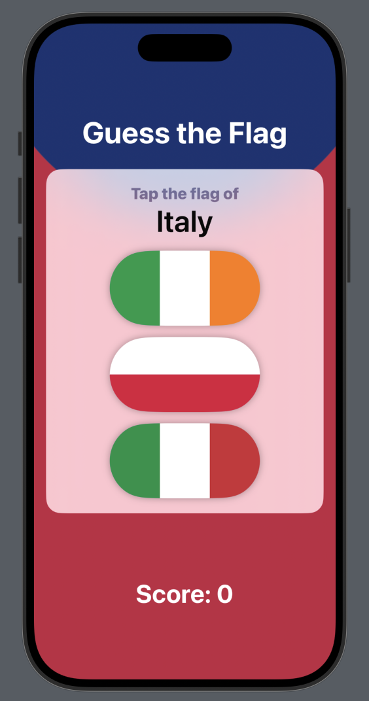

# GuessTheFlag 🌍🎌

**GuessTheFlag** is a fun and interactive flag quiz app built using SwiftUI. It challenges users to identify the correct flag from a set of three options. This project was created during the **30 Days of SwiftUI** challenge and focuses on core SwiftUI concepts like state management, views, and animations.

---

## 🎮 Features

- Randomized flag guessing quiz
- Score tracking based on correct/incorrect guesses
- Clean and responsive UI using SwiftUI
- Encourages learning and recognizing flags of the world

---

## 📸 Screenshot

---

## 🛠 Built With

- **SwiftUI**
- **Xcode**
- **Swift**

---

## 📚 What I Learned

This project helped me practice:

- `@State` property usage
- Button interaction and feedback
- Conditional UI updates
- Structuring views and components in SwiftUI

> Although I’m no longer actively pursuing SwiftUI, I’m proud of this project as part of my learning archive.

---

## 📁 Project Status

✅ Completed  
📦 Archived (not under active development)

---

## 📜 License

This project is open source and available under the [MIT License](LICENSE).
